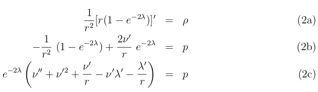
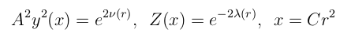

<!DOCTYPE html>
<html><head>
        <meta http-equiv="Content-Type" content="text/html; charset=UTF-8">
    </head>
    <body style="background-color: bisque">
        

        <h1 style="color: gray;">Hello from Payara!</h1>
        <h4 style="color: gray;">Generating potentials via difference equations</h4>
        <h4 style="color: gray;">S. D. Maharaj∗ and S. Thirukkanesh† 
Astrophysics and Cosmology Research Unit 
School of Mathematical Sciences 
University of KwaZulu-Natal 
Durban 4041, South Africa</h4>
        

        

            <table border="0" align="justify">
                <tbody><tr>
                    <td width="255px" style="background-color: gainsboro">
                        <h2 style="color: gray">Abstract</h2>
            
The condition for pressure isotropy, for spherically symmetric gravitational fields with
charged and uncharged matter, is reduced to a recurrence equation with variable, rational
coefficients. This difference equation is solved in general using mathematical induction
leading to an exact solution to the Einstein field equations which extends the isotropic
model of John and Maharaj. The metric functions, energy density and pressure are well
behaved which suggests that this model could be used to describe a relativistic sphere.
The model admits a barotropic equation of state which approximates a polytrope close
to the stellar centre.
    
                    </td>
                    <td width="525px" style="background-color: gainsboro">
                        <h2 style="color: gray">1 Introduction</h2>
                        
Solutions of the Einstein field equations for spherically symmetric gravitational fields in static
manifolds are necessary in the description of compact objects in relativistic astrophysics. The
models generated are utilised to describe relativistic compact objects where the gravitational
field is strong as is the case in neutron stars. It is for this reason that considerable energy and
time is devoted to the study of the mathematical properties and features of the underlying non-
linear differential equations. The detailed lists of Stephani et al [1] and Delgaty and Lake [2] for
static, spherically symmetric models provide a comprehensive collection of interior spacetimes
that match to the Schwarzschild exterior spacetime. It is important to note that only a few of

                    </td>
                    <td width="525px" style="background-color: gainsboro">                        
                        
these solutions correspond to nonsingular metric functions with a physically acceptable energy
momentum tensor. Some of the exact solutions to the field equations, which satisfy all the
physical requirements for a relativistic star, are contained in the models of the Durgapal and
Bannerji [3], Durgapal and Fuloria [4], Finch and Skea [5], Ivanov [6], Maharaj and Leach [7]
and Sharma and Mukherjee [8], amongst others.
In this paper our objective is to find new exact solutions to the Einstein field equations
which may be used to describe the interior spacetime of a relativistic sphere. The approach
essentially reduces to the analysis of difference equations which we demonstrate leads to explicit
solutions. We first express the Einstein equations, for neutral matter, as a new set of differential
equations utilising a transformation due to Durgapal and Bannerji [3] in §2. We choose a
general polynomial form for one of the gravitational potentials, which we believe has not been
studied before. This enables us to simplify the condition of pressure isotropy in §3 to a second
order linear equation in the remaining gravitational potential. We assume a series form for
this function which yields a difference equation which we manage to solve using mathematical
induction. It is then possible to exhibit a new exact solution to the Einstein field equations
which can be written explicitly as shown in §4. Our results contain the model of John and
Maharaj [9] as a special case. The curvature and matter variables appear to be well behaved in
the interior spacetime. We also demonstrate the existence of an explicit barotropic equation of
state relating the pressure to the energy density. For small values of the radial coordinate, close
to the stellar core, we demonstrate that the equation of state approximates a polytrope. Then
in §5 we consider the Einstein-Maxwell equations for charged matter. The solutions found in
the presence of an electromagnetic field reduce to the model for neutral matter given earlier in
§4. We believe that the method illustrated in this paper is a useful device in the production of
models for compact objects.

                    </td>
                </tr>
         </tbody></table>
       

        

            <table border="0">
                <tbody><tr>
                    <td width="255px" style="background-color: gainsboro">
                        <h2 style="color: gray">2 Field equations</h2>
                        
We assume that the spacetime manifold is static and spherically symmetric. This requirement
is consistent with models utilised to study physical processes in relativistic astrophysical objects
such as dense stars. The generic line element for static, spherically symmetric spacetimes is
given by

                        <!-- equation 1 -->
                    </td>
                    <td width="525px" style="background-color: gainsboro">
                        
in Schwarzschild coordinates. For neutral perfect fluids the Einstein field equations can be
expressed as follows

                        <!-- equation 2  -->
                    </td>
                    <td width="525px" style="background-color: gainsboro">
                        
for the spherically symmetric line element (1). The energy density ρ and the pressure p are
measured relative to the comoving fluid 4–velocity ua = e−ν δ a0 and primes denote differentiation
with respect to the radial coordinate r. In the field equations (2) we are utilising units where
the coupling constant 8πG
= 1 and the speed of light c = 1.
c4
A different but equivalent form of the field equations is obtained if we introduce a new
independent variable x, and new metric functions y and Z, as follows

                        <!-- equation 3 -->
                    </td>
                </tr>
            </tbody></table>
        

        </body></html>
